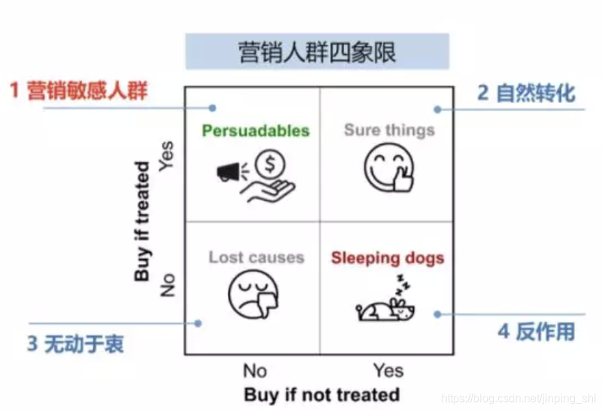

# Why We Need Uplift Modeling
---

Uplifting Modeling 是因果推理Causal Inference 的一种方法，既属于因果推断的问题范畴，也包含机器学习的知识。

Uplifting 衡量的是ITE，个体因果效应，见[Overview](./1_Overview_Uplift_Modeling.md)

## 为什么我们需要Uplifting Modeling?

一般业务中用到的预测模型，也可称为**响应模型（response model）**，比如用于预测给用户派发代金券后用户的购买概率，通过概率值，我们给转化概率高的用户派发代金券，降低成本。但是在这种场景下，我们要考虑用户是本来就有购买的意愿还是因为发放了优惠券诱使用户购买？对有发放优惠券这种有成本的营销活动，我们希望模型触达的是优惠券敏感的用户，即发放的优惠券促使用户购买，而对优惠券不敏感的用户——无论是否发券都会购买——最好不要发券，节省成本。 这是普通响应模型无法解决的问题。

我们可以将用户分为四种：

- persuadables不发券就不购买、发券才会购买的人群，即优惠券敏感人群
- sure thing：无论是否发券，都会购买，自然转化
- lost causes：无论是否发券都不会购买，这类用户实在难以触达到，直接放弃
- sleeping dogs：与persuadables相反，对营销活动比较反感，不发券的时候会有购买行为，但发券后不会再购买。

如果使用reponse model，则难以区分这几类人群，因为模型只预测是否购买，但人群的区分需要明确是否因为发放优惠券才导致了购买行为，这是一个因果推论问题（causal inference）。

**Uplifting Modeling(增益模型)**的主要目标是预测优惠券对购买概率的提升效果，即识别persuadables人群，并且要避免sleeping dogs人群，**这和商业营销目标一致**。

总体而言：我们需要解决**增量预估问题**
