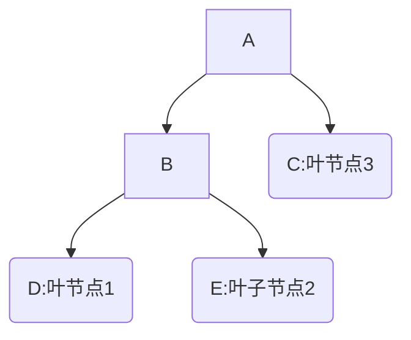

# 决策树

- $ID3$算法、$C4.5$算法、$CART$算法基本原理，见统计学习方法
- 为什么$ID3$算法倾向于选择取值多的特征，$C4.5$算法倾向于取值少的特征？
  - $ID3$算法用信息增益，当特征取值多时，$H(D, A)$较小，信息增益较大；
  - $C4.5$算法用信息增益比，即对信息增益添加了一个惩罚系数$IV(A)$（基于熵公式），当特征取值多时，特征A的熵越小，对应的倒数越大，即$IV(A)$越大。
  - 注意：$C4.5$在进行特征选择时，首先利用信息增益进行特征筛选，然后利用信息增益比在剩下的特征中进行筛选。
- 预剪枝和后剪枝区别
- 决策树的损失函数：每个叶子节点的熵值和
- 剪枝和正则系数$\alpha$的确定（见统计学习方法）。

# 集成学习

## bagging和boosting区别

## 随机森林

- 随机性体现：样本随机抽样、特征随机抽样
- 特征选择：
  - 步骤1：构建$N$个基学习器，计算损失函数$F$
  - 步骤2：对特征$X_1$，随机添加噪声，重新计算损失函数$F_1$
  - 步骤3：对其他特征重复步骤2
  - 步骤4：针对每个特征$F_n-F$排序，值越大，表明该特征越重要。
  - 步骤5：确定特征筛选阈值，比如删除掉步骤4中尾部20%的特征。
  - 重复步骤1-5，直到筛选出符合要求的特征数量。

# XGBoost基本原理

参考博客：https://zhuanlan.zhihu.com/p/92837676

### 构造目标函数

Boosting的预测值是相加的，大致思路如下：原始数据：

| $ID$ | $X$ | $Y$ |
| :----: | :---: | :---: |
|   1    |  12   |  22   |
|   2    |  34   |  12   |
|   3    |  22   |  32   |
|   4    |  14   |  15   |
|   5    |  11   |   6   |

第一轮：基于弱学习器$f_1$，以$X$为输入，得到预测值$\hat Y_1$，并得到与$Y_0$，即真实值的残差$Residual_1$，很明显，弱学习器$f_1$的预测能力较差，预测结果的残差较大。

| $ID$ | $X$ | $Y_1$ | $Residual_1$ |
| :----: | :---: | :-----: | :------------: |
|   1    |  12   |   18    |       4        |
|   2    |  34   |   14    |       -2       |
|   3    |  22   |   35    |       -3       |
|   4    |  14   |   18    |       -3       |
|   5    |  11   |   11    |       -5       |

第二轮：基于弱学习$f_2$，以$X$为输入，得到预测值$\hat Y_2$，并得到与第一轮预测结果的残差$Residual_1$的残差$Residual_2$

| $ID$ | $X$ | $Y_2$ | $Residual_2$ |
| :----: | :---: | :-----: | :------------: |
|   1    |  12   |    4    |       0        |
|   2    |  34   |  -1.5   |      -0.5      |
|   3    |  22   |   -2    |       -1       |
|   4    |  14   |   -4    |       1        |
|   5    |  11   |  -5.5   |      0.5       |

(如果第二轮残差仍然较大，照此思路继续训练弱学习器)

假设到第二轮，我们得到的残差值已经足够小，则停止训练，得到的最终预测值为$\hat Y_1+\hat Y_2$：

| $ID$ | $X$ | $Y$ | 预测值$\hat Y_1+\hat Y_2$ | 残差 |
| :----: | :---: | :---: | :-------------------------: | :--: |
|   1    |  12   |  22   |             22              |  0   |
|   2    |  34   |  12   |            12.5             | -0.5 |
|   3    |  22   |  32   |             33              |  -1  |
|   4    |  14   |  15   |             14              |  1   |
|   5    |  11   |   6   |             5.5             | 0.5  |

因此，最终的预测值 = 模型1预测值 + 模型2预测值 + 模型3预测值 + ....公式为：
$$
\hat Y_i = \sum_{k=1}^Kf_k(X_i),\qquad f_k \in F,即一共K个学习器
$$
从训练流程来说，Boosting是串行的，而Bagging是并行的。

- 首先，构造初始的目标函数如下：
  $$
  Obj_K = \sum_{i=1}^{n}l(y_i, \hat y_i)+\sum_{k=1}^K\Omega(f_k) 
  $$

  其中：$\sum_{i=1}^{n}l(y_i, \hat y_i)$为损失函数，$\sum_{k=1}^K\Omega(f_k)$为模型复杂度。(模型复杂度包括但不限于叶子节点数量、树深度、叶子节点值等)  

- 主要问题：已知前$K-1$棵树，如何构建第$K$棵树？
  对于样本$i$,第一棵树预测值为$ \hat y_i^{(1)}$, 第二棵树的预测值为$\hat y_i^{(2)}$，...，第$K-1$棵树的预测值为$\hat y_i^{(K-1)}$。

  给定$X_i$：
  $$
  \hat y_i^{(0)} = 0\\
  \hat y_i^{(1)} = f_1(X_i) = \hat y_i^{(0)} + f_1(X_i) \\
  \hat y_i^{(2)} = f_1(X_i) + f_2(X_i)= \hat y_i^{(1)} + f_2(X_i)\\
  ...\\
  \hat y_i^{(K)} = f_{K-1}(X_i) + f_K(X_i)= \hat y_i^{(K-1)} + f_K(X_i)
  $$
  得到第$K$棵树的预测值为：
  $$
  \hat y_i^{(K)} = \sum_{k=1}^{K-1}f_k(X_i)+f_K(X_i)
  $$

- 基于上述$\hat y_i^{(K)}$的表达式，重写损失函数：
  $$
  \begin{equation}
  \begin{aligned}
  Obj_K &= \sum_{i=1}^{n}l(y_i, \hat y_i)+\sum_{k=1}^K\Omega(f_k)\\
  &=\sum_{i=1}^{n}l(y_i, \hat y_i^{(K)})+\sum_{k=1}^K\Omega(f_k)\\
  &=\sum_{i=1}^{n}l(y_i, \hat y_i^{(K-1)}+f_k(X_i))+\sum_{i=1}^{K-1}\Omega(f_i) + \Omega(f_K)\\
  \end{aligned}
  \end{equation}
  $$

其中：$\hat y_i^{(K-1)}$和$\sum_{i=1}^{K-1}\Omega(f_i)$都是常数项。

需要使用$\hat y_i^{(K-1)}$ 估计 $\hat y _i^{(K)}$，因此保留，$\sum_{i=1}^{K-1}\Omega(f_i)$可以删除。
	
所以，当训练第$K$棵树时，我们的目标是：

$$
Minimize: \sum_{i=1}^{n}l(y_i, \hat y_i^{(K-1)}+f_k(X_i))+\Omega(f_K)
$$
以上是训练第$K$棵树时我们需要优化的目标函数，但仅仅是一个框架，下面将解释：目标函数如何近似？

## 如何近似目标函数

根据泰勒表达式，若函数$ f(x) $在包含$x_0$的某个闭区间$[a,b]$上具有$n$阶导数，且在开区间$(a,b)$上具有$n+1$阶导数，则对[闭区间$[a,b]$上任意一点$x$，成立下式：

$$
f(x)=\frac{f(x_0)}{0!}+\frac{f^{'}(x_0)}{1!}(x-x_0)+\frac{f^{''}(x_0)}{2!}(x-x_0)^2+...+\frac{f^{(n)}(x_0)}{n!}(x-x_0)^n+R_n(x)
$$

，即
$$
f(x+\Delta x) \simeq f(x)+f^{\prime}(x) \Delta x+\frac{1}{2} f^{\prime \prime}(x) \Delta x^{2}
$$

根据前文推导，假设树的结构已知，得到目标函数$ Obj_k$：
$$
\sum_{i=1}^{n}l(y_i, \hat y_i^{(K-1)}+f_k(X_i))+\Omega(f_K)
$$

假设$ f(x) = l(y_i, \hat y_i^{(K-1)}),  \Delta x = f_K(X_i)$ ,则 $f(x+ \Delta x) = l(y_i, \hat y_i^{(K-1)}+f_k(X_i)) $

因此，利用泰勒表达式二阶展开目标函数：

$$
Obj_k = \sum_{i=1}^n[l(y_i, \hat y_i^{(K-1)}) + \frac{\partial{l(y_i, \hat y_i^{(K-1)})}}{\partial y_i^{(K-1)}}*f_K(X_i)+\frac{1}{2}\frac{\partial^{2}{l(y_i, \hat y_i^{(K-1)})}}{\partial {y_i^{(K-1)}}^2}*f_K^2(X_i)+\Omega(f_K)\\
$$
其中：$\sum_{i=1}^n[l(y_i, \hat y_i^{(K-1)})$为常数，不参与优化，可以删除。$ \frac{\partial{l(y_i, \hat y_i^{(K-1)})}}{\partial y_i^{(K-1)}}$是常数，令其为$g_i$，$\frac{\partial^{2}{l(y_i, \hat y_i^{(K-1)})}}{\partial {y_i^{(K-1)}}^2}$也为常数，令其为$h_i$, 损失函数可以简化为：
$$
Minimize:Obj_K = \sum_{i=1}^{n}[g_i*f_K(X_i)+\frac{1}{2}h_i*f_K^2(X_i)]+\Omega(f_K)
$$
当训练第K棵树时，$ \{g_i,h_i\}$已知。

### 将树结构引入到目标函数

上文构造出了目标函数的新形式，接下来的目标时：将$ f_K(X_i)和\Omega(f_K)$参数化。

假设一棵树，叶子节点值定义为$w$,则下图中叶子节点的值分别为$ (w_1,w_2,w_3)$；定义样本$X_i$的位置为$q(X_i)$，则下图中，叶节点1位置为1，叶节点2位置为2，叶节点3位置为3，参数化$ f_K(X_i)=w_{q(X_i)}$,定义$I_j=\{i|q(X_i)=j\}$，即所有落在位置$j$的样本。

定义树的复杂度：$\Omega(f_K) = \gamma *T+\frac{1}{2}\lambda*\sum_{j=1}^Tw_j^2 $，其中$T$表示叶子节点数量，$w_j^2$表示叶子节点的值，$\gamma 和 \lambda$为超参数。

假设树的形状已知，则目标函数可改写为：
$$
\begin{equation}
\begin{aligned}
Obj_K &= \sum_{i=1}^{n}[g_i*f_K(X_i)+\frac{1}{2}h_i*f_K^2(X_i)]+\Omega(f_K)\\
&=\sum_{i=1}^n[g_i*w_{q(X_i)}+\frac{1}{2}h_i*w^2_{q(X_i)}]+\gamma*T+\frac{1}{2}*\lambda*\sum_{j=1}^Tw_j^2\\
&=\sum_{j=1}^T[(\sum_{i\in I_j}g_i)*w_j+\frac{1}{2}(\sum_{i\in I_j}h_i+\lambda)*w_j^2]+\gamma *T\\
& (其中，\sum_{i\in I_j}g_i为常数，令其为G_j,\sum_{i\in I_j}h_i 也为常数，令其为H_j)\\
&=\sum_{j=1}^T[G_j*w_j+\frac{1}{2}*(H_j+\lambda )*w_j^2]+\gamma*T
\end{aligned}
\end{equation}
$$

很明显，上式为一个一元二次方程$ (ax^2+bx+c=0)$，在$T$确定的情况下，最优解为$ -\frac{b}{2a}$，则上式最优解为$-\frac{G_j}{H_j+\lambda}$，故得到目标函数的最优值：
$$
Obj_K^* = -\frac{1}{2}*\sum_{j=1}^T\frac{G_j^2}{H_j+\lambda}+\gamma*T
$$

### 寻找最优的Split

前文的推导均假设树的结构已知，并得到了最优的目标函数值。如果树的结构未知，如何做？

决策树在划分时，基于信息增益/信息增益比/基尼系数，寻找最优的split。

同样，根据我们计算出来的最优目标函数值，在划分特征时，尽量选择$$Gain=Obj^*_{Knew}-Obj^*_{Kold}$$最大的特征进行划分。
$$
\begin{equation}
\begin{aligned}
Gain&=Obj^*_{Knew}-Obj^*_{Kold}\\
&=\frac{1}{2}*[\frac{G_L^2}{H_L+\lambda}+\frac{G_R^2}{H_R+\lambda}-\frac{(G_L+G_R)^2}{H_L+H_R+\lambda}]-\gamma
\end{aligned}
\end{equation}
$$

### 总结
1. XGB的优点？
- 支持多种损失函数。其构造目标函数时将Loss损失函数置入常数项，使其可以支持多种损失函数
- 支持并行化，对特征值提前进行遍历，并保存为内存中的block

2. XGB分裂原则？
- 目标函数Obj在分裂前后的差值

3. XGB在拟合什么？
- XGB没有拟合目标，而是依据规则对树进行分裂，在接近真实值y的同时控制树的复杂度，使整体的模型具有范化性

