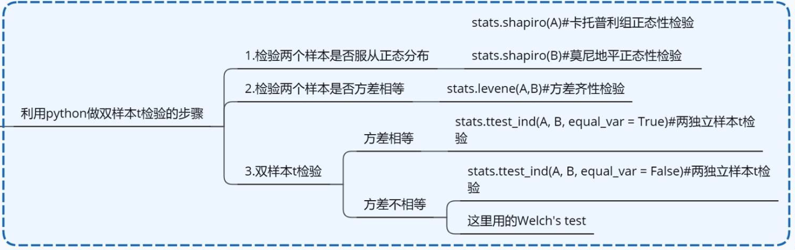

# t检验
----

即学生t检验

适用场景：
样本容量小（n < 30）, 总体标准差未知的正态分布
t检验的前提：
1. 来自正态分布总体；
2. 随机样本 ；
3. 双样本均数比较时，要求两样本总体方差相等，即具有方差齐性（用F检验）
4. 单样本t检验时，取自同一总体的样本需同方差

***T分布的概率密度函数的形状类似于标准正态分布（μ=0, σ2=1），但更低更宽。随着自由度 v 的增加，则越来越接近均值为0方差为1的正态分布。***

**T检验&F检验的差异**：T检验用来检测数据的准确度--**系统误差**；F检验用来检测数据的精密度--**偶然误差**。
### 1. 单总体检验

单总体t检验是检验一个 [样本平均数](https://baike.baidu.com/item/%E6%A0%B7%E6%9C%AC%E5%B9%B3%E5%9D%87%E6%95%B0) 与一个已知的 [总体平均数](https://baike.baidu.com/item/%E6%80%BB%E4%BD%93%E5%B9%B3%E5%9D%87%E6%95%B0) 的差异是否显著。

样本平均数与总体平均数的 [离差](https://baike.baidu.com/item/%E7%A6%BB%E5%B7%AE) [统计量](https://baike.baidu.com/item/%E7%BB%9F%E8%AE%A1%E9%87%8F) 呈t分布
总体t检验统计量为：

$$t=\frac{\bar{X}-\mu}{\frac{\sigma_{X}}{\sqrt{n}}}$$

因为样本容量小，所以要考虑自由度n， n为样本容量

### 2. 双总体检验
双总体t检验是检验两个 [样本平均数](https://baike.baidu.com/item/%E6%A0%B7%E6%9C%AC%E5%B9%B3%E5%9D%87%E6%95%B0) 与其各自所代表的总体的差异是否显著。 
#### 2.1 等方差独立样本t检验，
**两总体方差相同且未知**，且各实验处理组之间毫无相关存在，即为**独立样本**
[t统计量](https://baike.baidu.com/item/%E7%BB%9F%E8%AE%A1%E9%87%8F) 为： 

$$
t=\frac{\bar{X}_{1}-\bar{X}_{2}}{\sqrt{\frac{\left(n_{1}-1\right) S_{1}^{2}+\left(n_{2}-1\right) S_{2}^{2}}{n_{1}+n_{2}-2}\left(\frac{1}{n_{1}}+\frac{1}{n_{2}}\right)}}
$$

$S_{1}^{2}$和$S_{2}^{2}$为两 [样本方差](https://baike.baidu.com/item/%E6%A0%B7%E6%9C%AC%E6%96%B9%E5%B7%AE) ；
$n_{1}$和$n_{2}$为两 [样本容量](https://baike.baidu.com/item/%E6%A0%B7%E6%9C%AC%E5%AE%B9%E9%87%8F) 。 

#### 2.2 异方差独立样本t检验
**两总体方差不等且未知**，各实验处理组之间毫无相关存在，即为**独立样本**

由于总体方差不等，[Behrens–Fisher problem](https://link.zhihu.com/?target=https%3A//en.wikipedia.org/wiki/Behrens%25E2%2580%2593Fisher_problem)

使用**Welch's t test**，又名**Welch's unequal variances t-test**、**unequal variances t-test（不等方差检验）**

统计量的分母已**不是总体方差的无偏估计**，需重新构造一个统计量，这里需要利用**Satterthwaite近似法**
$$t=\frac{\bar{X}_{1}-\bar{X}_{2}}{\sqrt{\frac{s_{1}^{2}}{n_{1}}+\frac{s_{2}^{2}}{n_{2}}}}$$

它的自由度**df**（degrees of freedom）：
$$\nu \approx \frac{\left(\frac{s_{1}^{2}}{n_{1}}+\frac{s_{2}^{2}}{n_{2}}\right)^{2}}{\frac{s_{1}^{4}}{n_{1}^{2} \nu_{1}}+\frac{s_{2}^{4}}{n_{2}^{2} \nu_{2}}}$$

其中$v_{1}=n_{1}-1$,$v_{2}=n_{2}-1$分别是$X_{1}$,$X_{2}$的自由度，当$n_1,n_2>5$时，近似t分布的效果比较好。
根据计算得到的自由度v查表得p-value

#### 2.3 配对样本检验
**检验匹配而成的两组被试获得的数据** 或 **同组被试在不同条件下所获得的数据** 的差异性。
配对样本t检验可视为单样本t检验的扩展，不过检验的对象由一群来自常态分配独立样本更改为二群配对样本之观测值之差。若二配对样本$x_{1i}$与$x_{2i}$之差为$d_i = x_{1i}-x_{2i}$独立，且来自常态分配，则$d_i$之母体期望值μ是否为μ0可利用以下统计量：

$$t=\frac{\bar{d}-\mu_{0}}{s_{d} / \sqrt{n}},i=1 \ldots n$$

其中:
$\bar{d}$为配对样本差值之平均数
$$\bar{d}=\frac{\sum_{i=1}^{n} d_{i}}{n}$$

$s_{d}$为配对样本差值之 [标准偏差](https://baike.baidu.com/item/%E6%A0%87%E5%87%86%E5%81%8F%E5%B7%AE) ，n为配对样本数。该统计量t在零假说：μ=μ0为真的条件下服从自由度为n−1的 [t分布](https://baike.baidu.com/item/t%E5%88%86%E5%B8%83) 。 

$$s_{d}=\sqrt{\frac{\sum_{i=1}^{n}\left(d_{i}-\bar{d}\right)^{2}}{n-1}}$$

拓展：

