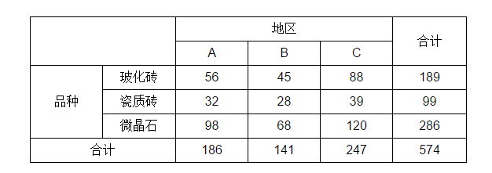

# 列联表

----
列联表(Contingency Table)又称为*R*×*C*表，*R*表示行(Row)，*C*表示列(Column)。最常见的就是下面的二维表，另外还有一维表和多维表。这里的维，指的是我们研究的变量数，有两个变量就是二维的，这两个变量可以是两个*X*或*Y*，也可以是一个*X*和一个*Y*，即两个变量可以是**并列**的，也可以是**因果**的。

## 双向无序列联表的独立性分析
这是最常见的一种表，其特征是行和列变量都是类别变量，变量的不同取值之间没有程度上的差异。如这张针对不同地区对地板砖购买倾向的调查汇总表：

X和Y都非有序，用**Pearson卡方检验**

$$ \chi^{2}=\sum_{i=1}^{r} \sum_{j=1}^{c} \frac{\left(n_{i j}-E_{i j}\right)^{2}}{E_{i j}} $$

**注意**：卡方检验要求表中不能有期望频数小于1的单元格，如果有，则需要采用Fisher精确检验；其二是期望频数小于5的单元格不能超过20%

如果有多于20%的单元格期望频数小于5，卡方统计量会变大，也容易造成假阳性(第一类错误a)的概率增大，这时可以采用**似然比卡方**进行修正。

似然比卡方，其自由度和临界值与Pearson卡方查表一致
$$ \chi_{L}^{2}=2 \sum_{i=1}^{r} \sum_{j=1}^{c} n_{i j} \ln \left(\frac{n_{i j}}{E_{i j}}\right) $$

### 双向无序列联表相关程度的度量
卡方检验是否相关，进一步用系数衡量相关程度
#### 1. C系数
C系数称为列联相关系数，主要用于**n*n**的方阵列联表（一般大于2），其公式为
$$ C=\sqrt{\frac{x^{2}}{\chi^{2}+n}} $$

N为样本量，非格子数

当两个变量完全独立时，卡方=0，此时C=0；从公式上看，C不可能等于1。当然C越大，说明两个变量的关系越密切。

#### 2. Cramer’s V系数
对四格表系数φ用于多格表时的修正用法。
$$ V=\sqrt{\frac{\chi^{2}}{n \times \min [(r-1),(c-1)]}} $$
当两个变量完全无关时，V=0，两个变量完全相关时，V=1，因此这个值越接近1，说明两个变量的关系越密切。

如果卡方检验证明两个变量无关，就没有必要计算列联相关系数了。

